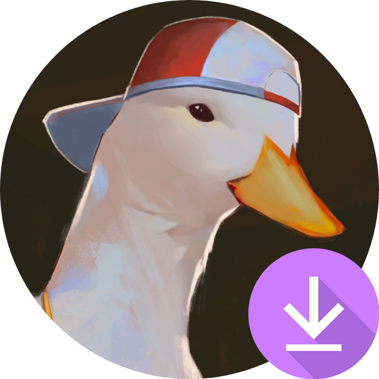
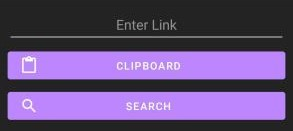

#  Cofivid

- [Description](#description)
- [Download](#download)
- [Usage](#usage)
- [_Why do I receive a "Blocked by Play Protect" / "Unknown source"
  pop-up?_](#why-do-i-receive-a-blocked-by-play-protect--unknown-source-pop-up)
- [_Where are my downloads?_](#where-are-my-downloads)
- [_Why are the files named in a weird way?_](#why-are-the-files-named-in-a-weird-way)
- [_My app is crashing/failing to download a video! What do I
  do?_](#my-app-is-crashingfailing-to-download-a-video-what-do-i-do)
- [Planned features](#planned-features)

## Description

Android app in Java to download videos from multiple platforms. After copying the link of a video,
your file is about two taps away from being downloaded!

Currently supported platforms:

- **YouTube**
- **Reddit** (domains: `v.redd.it`, `i.redd.it`, `imgur.com`, `i.imgur.com`, `gfycat.com`)

Available file conversions for downloads:

- **MP4** to **MP3**
- **MP4** to **GIF** (Reddit only)
- **GIF** to **MP4**

## Download

You can download the latest version of the app from the
[Releases](https://github.com/CofiPRT/Cofi-Video-Downloader/releases/latest) page.

Multiple architectures are supported, including `arm64-v8a`, `armeabi-v7a`, `x86`, and `x86_64`.
If you're not sure which one to use, you can try the `universal` version, although the download size may be larger.

You can then install the APK file by opening it with your preferred file manager app.

## Usage

Upon launching the app, you will be met with a simple search box

You can either:

- Type or paste the link of the video into the text field then tap on the **SEARCH** button
- Copy the link of the video into your clipboard and then tap on the **CLIPBOARD** button.
  The search will be started automatically upon tapping this button.

Upon a successful search, the title of the video along with its thumbnail (if available) will be displayed.

A **DOWNLOAD** button along with the available conversion options will also be displayed.

Keep in mind that the desired conversion option must be selected **before** starting the download.

## *Why do I receive a "Blocked by Play Protect" / "Unknown source" pop-up?*

This app is not available on the Play Store, so this kind of messages are to be expected when installing
apps from other sources.

The source code is right above, so analyze it as you wish.

## *Where are my downloads?*

All downloads are saved to the `Downloads` folder of your device. You should be able to access this folder
using a File Manager app, or by connecting your device to your computer.

Videos and gifs should also be visible in your gallery app.

## *Why are the files named in a weird way?*

Mainly to avoid duplicate file names and to not spoil the content of the video by using the original title.

If requested, an option to keep the original title of the video will be added.

## *My app is crashing/failing to download a video! What do I do?*

Please either contact me via any convenient method or open an issue on GitHub.
When doing so, please include the link of the video you're trying to download.

## Planned features

- Support for more platforms:
    - Instagram
    - TikTok
    - Facebook
    - Twitter
- Ability to keep the original title of the video
- **(Highly ambitious)** Add separate tabs for completely new features:
    - Simple video trimming, resizing, and compressing
    - Simple image cropping, resizing, and drawing
    - Simple audio trimming